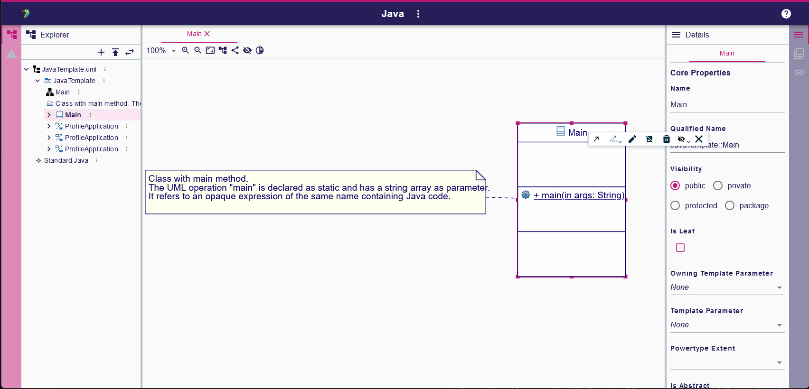

= Papyrus Web
:toc:

Papyrus web is a web UML modeler to easily create UML diagrams directly from a web browser. It is based on Eclipse Sirius Components (https://www.eclipse.org/sirius/sirius-web.html[Eclipse Sirius Web])



This repository, `papyrus-web` is a mono repo containing both frontend and backend components.

To test _Papyrus Web_ you have two possible options:

. If you just want to run an already built version of the example application, follow link:#quick-start[the Quick Start].
. If you want to _build_ the application yourself, follow link:#build[the complete Build instructions].

[#quick-start]
== Quick Start

If you want a quick overview of how Papyrus Web looks and feels like without building the sample application yourself, you will simply need:

* Java 17
* Docker, or an existing PostgreSQL 12 (or later) installation with a DB user that has admin rights on the database (those are needed by the application to create its schema on first startup).

To actually run the application:

1. Papyrus Web uses PostgreSQL for its database. For development or local testing, the easiest way is to start a PostgreSQL instance using Docker.
+
[#docker-db, reftext=Docker command]
[source,sh]
----
docker run -p 5434:5432 --name papyrus-web-postgres \
                            -e POSTGRES_USER=dbuser \
                            -e POSTGRES_PASSWORD=dbpwd \
                            -e POSTGRES_DB=papyrus-web-db \
                            -d postgres
----
+
WARNING: This may take a while the first time you run this as Docker will first pull the PostgreSQL image.
+
If you do not have Docker or want to use an existing PostgreSQL installation, adjust the command-line parameters below and make sure the DB user has admin rights on the database; they are needed to automatically create the DB schema.

2. Start the application:
+
[source,sh]
----
java -jar papyrus-web-application.jar \
          --spring.datasource.url=jdbc:postgresql://localhost:5434/papyrus-web-db \
          --spring.datasource.username=dbuser \
          --spring.datasource.password=dbpwd \
          --spring.liquibase.change-log=classpath:db/changelog/papyrus-web.db.changelog.xml
----
3. Point your browser at http://localhost:8080 and enjoy!
+
WARNING: The initial version of Papyrus Web has some known issues with Firefox.
It is recommended to use a Chrome-based browser until these are fixed.

NOTE: Do not forget to stop the PostgreSQL container once you are done: `docker kill papyrus-web-postgres`. 
Note that this will remove all the data you have created while testing the application.

[#build]
== Building

[#build-requirements]
=== Requirements

To build the application yourself you will need the following tools:

* Git, and a GitHub account
* To build the frontend:
** Recent versions of https://nodejs.org/[Node and NPM]: in particular, Node >= 16.6 is required along with npm >= 7.20.
// ** https://rollupjs.org/[rollup] (`npm install -g rollup`)
// ** https://github.com/whitecolor/yalc[yalc] (`npm install -g yalc`)
* To build the backend:
** Java 17
** Recent version of Maven from https://maven.apache.org/download.cgi[Apache Maven download page]

WARNING: Note that there are issues with npm under Windows Subsystem for Linux (WSL). If you use WSL and encounter error messages like _"Maximum call stack size exceeded"_ when running NPM, switch to plain Windows where this should work.

[#github-token]
=== GitHub Access Token

The backend of _Papyrus Components_ depends on https://github.com/eclipse-sirius/sirius-emf-json[`sirius-emf-json`] and https://github.com/eclipse-sirius/sirius-components[`sirius-components], which is published as Maven artifacts in _GitHub Packages_.
To build `papyrus-web` locally, you need a _GitHub Access Token_ so that Maven can download the `sirius-emf-json` artifacts.

. Create a personal token with a scope of `read:package` by following https://docs.github.com/en/authentication/keeping-your-account-and-data-secure/creating-a-personal-access-token#creating-a-personal-access-token-classic[the GitHub documentation] if you do not have one already.
+
WARNING: Once generated, a token cannot be displayed anymore, so make sure to copy it in a secure location.
. Create or edit `$HOME/.m2/settings.xml` to tell Maven to use this token when accessing the Sirius EMF JSON repository:
+
[source,xml]
----
<?xml version="1.0" encoding="UTF-8"?>
<settings xmlns="http://maven.apache.org/SETTINGS/1.0.0"
          xmlns:xsi="http://www.w3.org/2001/XMLSchema-instance"
          xsi:schemaLocation="http://maven.apache.org/SETTINGS/1.0.0 https://maven.apache.org/xsd/settings-1.0.0.xsd">
  <servers>
    <server>
      <id>github-sirius-emfjson</id>
      <username>$GITHUB_USERNAME</username>
      <password>$GITHUB_ACCESS_TOKEN</password>
    </server>
    <server>
      <id>github-emfjson</id>
      <username>$GITHUB_USERNAME</username>
      <password>$GITHUB_ACCESS_TOKEN</password>
    </server>
    <server>
      <id>github-papyrus-sirius-uml2</id>
      <username>$GITHUB_USERNAME</username>
      <password>$GITHUB_ACCESS_TOKEN</password>
    </server>
    <server>
      <id>papyrus-uml-services</id>
      <username>$GITHUB_USERNAME</username>
      <password>$GITHUB_ACCESS_TOKEN</password>
    </server>
    <server>
      <id>github-sirius-components</id>
      <username>$GITHUB_USERNAME</username>
      <password>$GITHUB_ACCESS_TOKEN</password>
    </server>
  </servers>
</settings>
----
+
Be sure to replace `$GITHUB_USERNAME` with your GitHub user id, and `$GITHUB_ACCESS_TOKEN` with the value of your acess token done in the previous step.
+
IMPORTANT: The `id` used in your `settings.xml` *must* be the ones mentioned above to match what is used in the POMs.
. Create or edit `$HOME/.npmrc` and add the following line:
+
----
//npm.pkg.github.com/:_authToken=$GITHUB_ACCESS_TOKEN
----
+
Again, be sure to replace `$GITHUB_ACCESS_TOKEN` with the value of your acess token.

[#build-steps]
=== Build Papyrus web application

Build steps:

. Clone the Papyrus Web repository https://github.com/PapyrusSirius/papyrus-web[papyrus-web]

. Build the frontend ([.small]#from the `frontend` subfolder of Papyrus web main location#):
+
[source,sh]
----
npm ci
npm run build
----

. Install the frontend artifacts as static resource to be served by the backend. From the root directory of the repository:
+
[source,sh]
----
mkdir -p backend/papyrus-web-frontend/src/main/resources/static
cp -R frontend/papyrus-web/dist/* backend/papyrus-web-frontend/src/main/resources/static
----

. Build the backend ([.small]#from the `backend` subfolder of Papyrus web main location#):
+
[source,sh]
----
mvn clean verify
----
+
The result is a ready-to-run, Spring Boot "fat JAR" in backend/papyrus-web-application/target/papyrus-web-application-<VERSION>.jar. Refer to the instructions in the "Quick Start" section above to launch it.

[Dev-env]
=== Development environment
Here are instructions that new papyrus web developer could follow in order to set up his/her development environment.

[NOTE]
=====
The set up of the Github token is required for setting up back end and front (see <<github-token>>)
=====

==== Backend set up

. Download and install Spring Tools Suite https://github.com/spring-projects/sts4/wiki/Previous-Versions#spring-tools-4153-changelog[4.15.3] for Eclipse (named STS)

. Set up preferences
+
* Uncheck _Maven/Automatically update Maven projects configuration_
* Set _Maven/'Errors/Warnings'/Plugin execution_ not covered by lifecycle configuration to "ignore"

. Clone Papyrus web repositories:
+
* https://github.com/PapyrusSirius/papyrus-web[papyrus-web] repo
* https://github.com/PapyrusSirius/papyrus-uml-services[Papyrus UML services] repo

. Import Papyrus web projects in workspace
+
* From Papyrus web repository import all terminal Eclipse projets located in the backend folder
* From Papyrus UML services repository import the following projects:
** `papyrus-uml-services/plugins/org.eclipse.papyrus.uml.domain.services`
** `papyrus-uml-services/plugins/org.eclipse.papyrus.uml.domain.services.test`
** `papyrus-uml-services/releng/org.eclipse.papyrus.uml.domain.services.resources`
** `papyrus-uml-services/releng/org.eclipse.papyrus.uml.domain.services.releng.target`

[NOTE]
====
In order to use the project _papyrus-uml-services/plugins/org.eclipse.papyrus.uml.domain.services_ in your runtime you need to add the following line in _\papyrus-uml-services\plugins\org.eclipse.papyrus.uml.domain.services\.classpath_. This change should not be committed.
```xml
<classpathentry kind="output" path="target/classes"/>
```
====

For windows users, please set your git configuration to:

* git config core.autocrlf true
* git config core.eol lf
* git config user.name "$FirstName $ SecondName"
* git config user.email "$email"


[WARNING]
====
Please ensure that the email used in your commit and in your Github account is the one used to sign the Eclipse CLA.
If you do not have signed the https://www.eclipse.org/legal/ECA.php[Eclipse CLA] please do before any contribution.
====

. Set up the target platform
+
* Open `papyrusSiriusServices.target` file located in `org.eclipse.papyrus.uml.domain.services.releng.target` plugin and wait for the target platform to be resolved.
* At the top right corner of the Target Definition editor, click on *Active Target Platform* link
+
This link should be replaced by *Reload Target Platform* once it is done

. Set up Checkstyle addon
+
* Install Checkstyle addon with the folloing update site:
+
[source]
----
https://checkstyle.org/eclipse-cs-update-site
----

* Import the project _backend/papyrus-web-resources_ in your workspace.
This project contains the checkstyle configuration for _Papyrus Web_.
All projects are configured to point to this configuration file.
+
[source]
----
backend/papyrus-web-resources/checkstyle/CheckstyleConfiguration.xml
----

. Set up the code formatter
+
* Window > Preferences > Java > Code Style > Formatter > Import...
* Select the following file from papyrus web local repository:
+
[source]
----
backend/papyrus-web-resources/editor/formatter.xml
----


. Set up code templates for new files/types
+
* Window > Preferences > Java > Code Style > Clean Up > Import...
* Select the following file from papyrus web local repository:
+
[source]
----
backend/papyrus-web-resources/editor/CleanupProfile.xml
----


. Set up clean up 
+
* Window > Preferences > Java > Code Style > Code Templates
* Select the following file from papyrus web local repository:
+
[source]
----
backend/papyrus-web-resources/editor/
----


. Install Target Platform Definition DSL (Optional)
+
* Help > Install New Software...
* Use the following updatesite URL
+
[source]
----
https://download.eclipse.org/cbi/updates/tpd/nightly/latest/
----

[#backend-launch-config,reftext=Launch configuration]
[start=7]
.  Create Launch Configuration for Papyrus web server
+
* From Debug toolbar action open Debug Configurations...
* Select Spring Boot App
* Click on New icon action to create a Spring boot launch configuration
* Name this launch configuration (e.g `Papyrus web backend`)
* Choose `papyrus-web-application` in the project dropdown
* Search and select `org.eclipse.papyrus.web.application.PapyrusApplication` as the Main type
* Choose the `dev` profile in the Profile dropdown
* In the Arguments tab, add the following VM argument:
+
[source]
----
-Dsirius.components.cors.allowedOriginPatterns=*
----
+
* Click on Apply to save the launch configuration

==== Frontend set up

. Open the `frontend` folder in VSCode
. Install dependencies using `npm install` in the terminal

==== Launch Application as a developer 

. Run database docker image (see <<docker-db>>)
. Launch backend from STS (see <<backend-launch-config>>)
. Launch frontend `npm start`

== License

Everything in this repository is Open Source. Except when explicitly mentioned otherwise (e.g. for some resources likes images), the license is Eclipse Public License* v 2.0.


== Coding rules

=== Headers

.File Header
The header of each file should contain the following copyright block:

[source,java]
----
/*****************************************************************************
 * Copyright (c) $Years $Authors. // <1> <2>
 *
 * All rights reserved. This program and the accompanying materials
 * are made available under the terms of the Eclipse Public License 2.0
 * which accompanies this distribution, and is available at
 * https://www.eclipse.org/legal/epl-2.0/
 *
 * SPDX-License-Identifier: EPL-2.0
 *
 * Contributors:
 *  $Contributor - Initial API and implementation // <3>
 *****************************************************************************/
----
<1> $Years : Either the year of the file creation or the year of the file creation year, a comma and the year of the last modification 
<2> $Authors : List of name of all the owners separated by a comma
<3> $Contributor : Name of the contributor

For instance a file contributed by Obeo funded by CEA LIST project should contain the following header:
[source,java]
----
/*****************************************************************************
 * Copyright (c) 2023 CEA LIST, Obeo
 *
 * All rights reserved. This program and the accompanying materials
 * are made available under the terms of the Eclipse Public License 2.0
 * which accompanies this distribution, and is available at
 * https://www.eclipse.org/legal/epl-2.0/
 *
 * SPDX-License-Identifier: EPL-2.0
 *
 * Contributors:
 *  Obeo - Initial API and implementation
 *****************************************************************************/
----

.Class Type Header
[source,java]
----
/**
 * $Javadoc <1>
 *
 * @author $Name <2>
 */
----
<1> $Javadoc : The Javadoc
<2> $Name :  Your first name and second name with first Capital letter

WARNING: Add the `-Duser.name=$Name` in the file _SpringToolSuite4.ini_. +
For instance, Arthur's init file contains `-Duser.name=Arthur Daussy`

For instance, a class contributed by Arthur should have the following header:
[source,java]
----
/**
 * Some details about the class.
 *
 * @author Arthur Daussy
 */
----