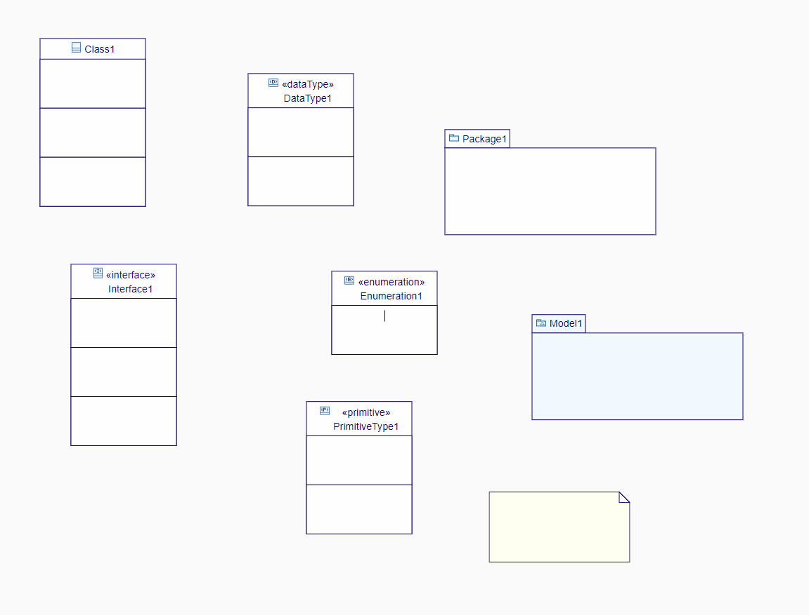
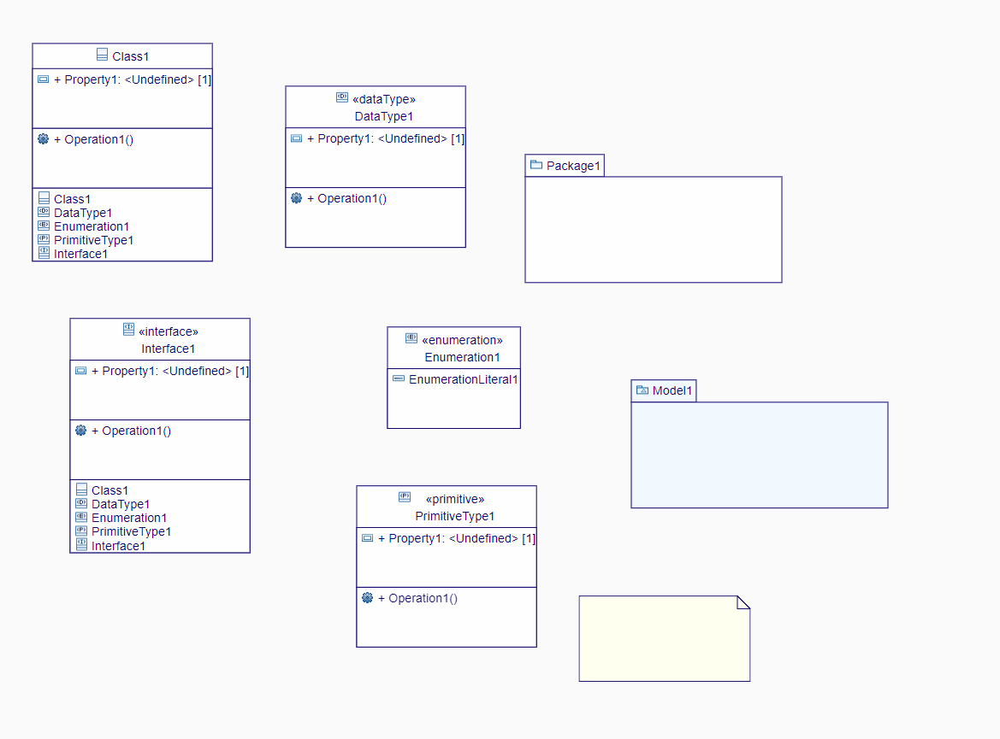
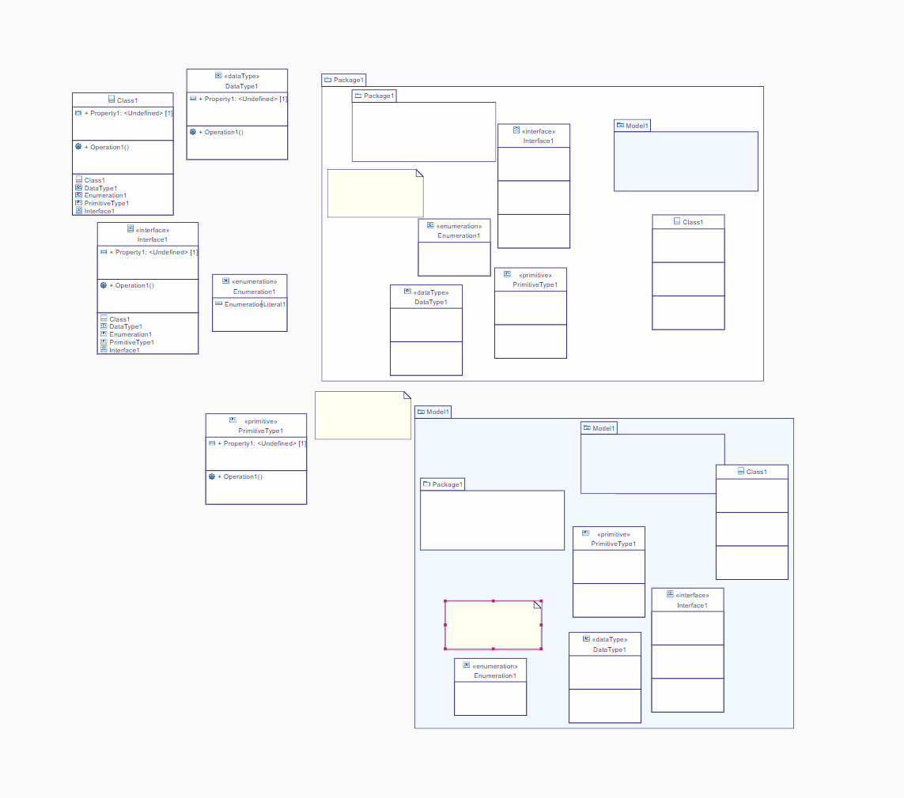
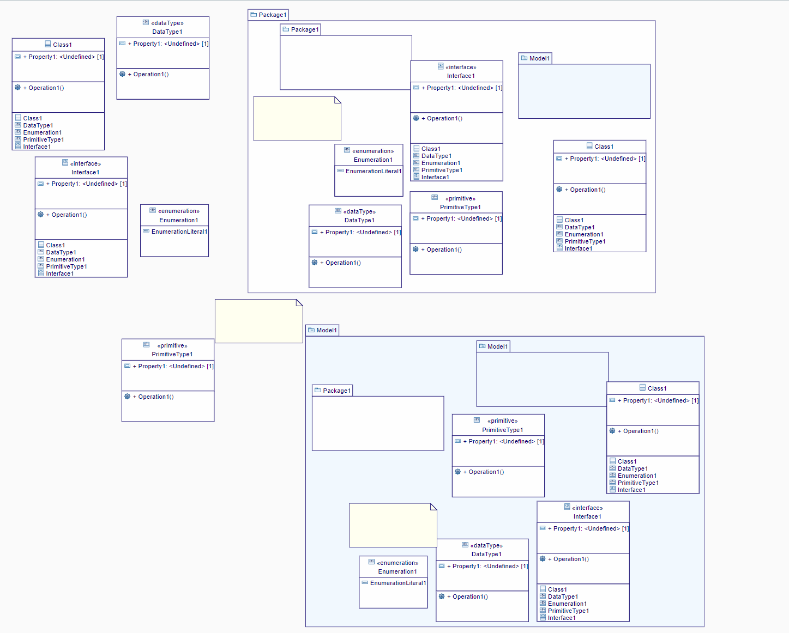
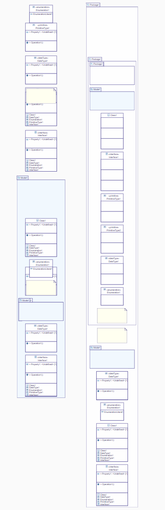
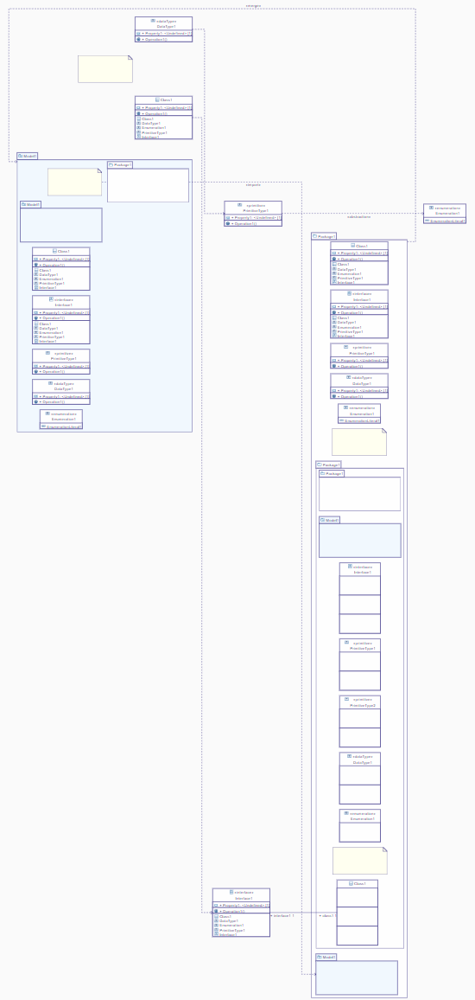
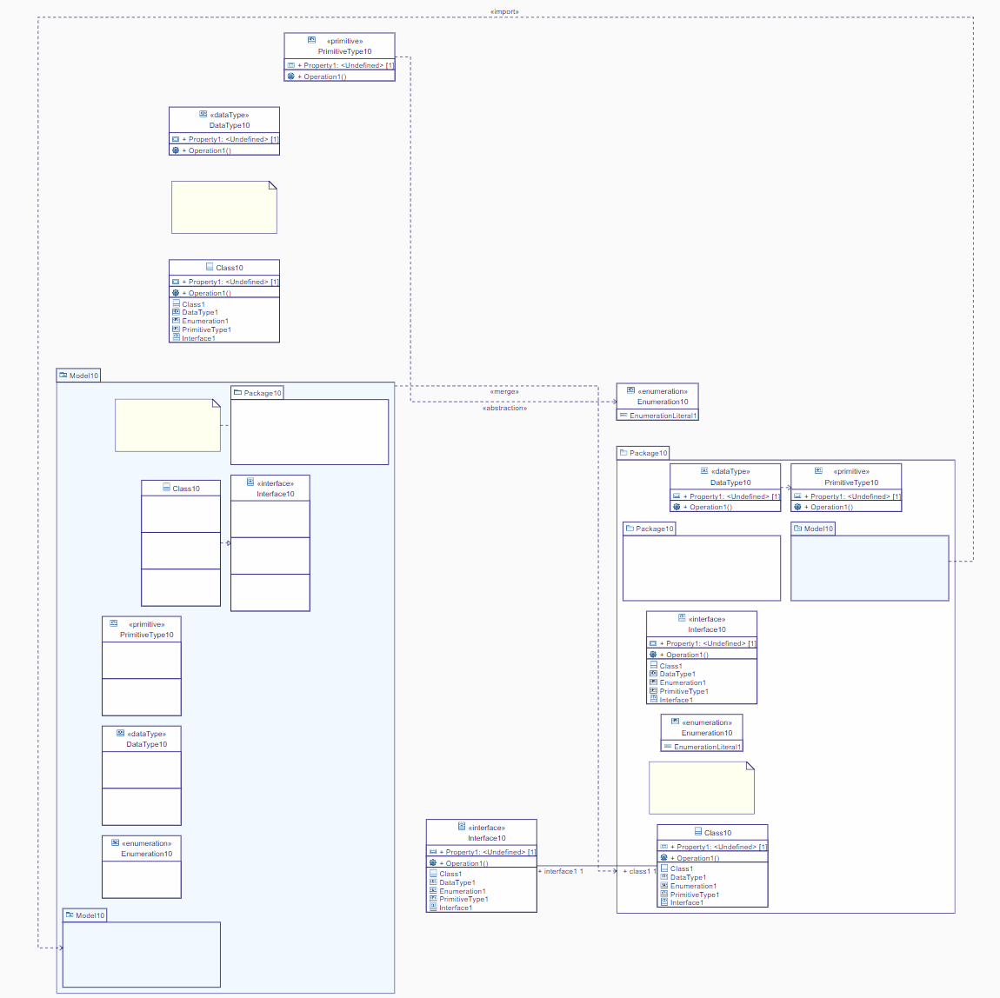
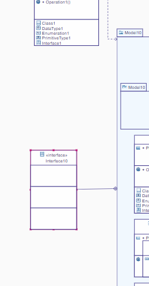

= Class Diagram tests
:toc:

[WARN]
====
Do all those tests sequentially
====

== CD01 - Node Creations

.Purpose
Check all node creations in the _Class Diagram_

.Recipe

. Create a new project: _CD01_ from _UML template.
. From the _Explorer_ view use the contextual menu from *Model* to create a new _Class Diagram_.
** [ ] A new empty _Class Diagram_ is created and opened
. Using the _palette_ creates the following root elements:
** _Class_
** _Interface_
** _DataType_
** _Enumeration_
** _Primitive Type_
** _Package_
** _Model_
** _Comment_ 
*** [ ] The diagram should look like this
+

+
. For all nodes with _list compartment_ create one instance for each child
+
[INFO]
====
In the _Nested Classifier Compartment_ of the _Class_ use both the _normal_ tools (available from the background of the compartement) and the _sibling_ tools (available when another _nested classifier_ is selected).
====
+

+
. In both the _Package_ and the _Model_ create all possible children
+

+
. In the _Package 1_, for all those children with compartment list, create all possible children.
+

+
. In *Package1::Package1* create all possible children.
+

== CD10 - Edge Creations

.Requiments
. Start from the state of _CD01_

.Purpose
Check all edges creation in the _Class Diagram_

[WARNING]
====
In the current version _2023.3.0_, the layout of the edge is broken due to https://github.com/eclipse-sirius/sirius-components/issues/1683[1683]. After each eadge creation use the _auto _layout feature_
====

.Recipe
. Create a _Package Merge_ between *Package1* and *Model1*
** [ ] A link between those nodes appears with label «merge»
. Create a _Package Import_ between *Package1::Package1* and *Model1::Model1*
** [ ] A link between those nodes appears with label import
. Using the _Connector_ tool ceate an _Abstraction_ between *PrimitiveType1* and *Enumeration1*
** [ ] A link without «abstraction» should be displayed between those nodes.
. Create a _Dependency_ between *Package1::DataType1* and *Package1::PrimitiveType1*
** [ ] A link without label should be displayed between those nodes.
. Create a _InterfaceRealization_ between *Model1::Class1* and *Model1::Interface1*
** [ ] A link without label should be displayed between those nodes.
. Link the comment *Model1::Comment* to *Model1::Package1*
** [ ] A link without a label should be displayed between those those
** [ ] *Package1* should now belong to the _annotatedElement_ feature of the _Comment_ (Look into the _Property View__).
. Creates an association between *Interface1* and *Package1::Class1*
** [ ] A link with no centered label is displayed
** [ ] The _begin label_ of the edge is *+ interface1 1*
** [ ] The _end label_ of the edge is *+ class1 1*
+

+
. Create a _Shared Association_ between *Interface1* and *Package1::Class1*
** [ ] A link with no centered label is displayed
** [ ] The _begin label_ of the edge is *+ interface1 1*
** [ ] The _end label_ of the edge is *+ class1 1*
** [ ] The source decorator is an empty diamond
** [ ] The end decorator is an arrow
. Create a _Composite Association_ between *Interface1* and *Package1::Class1*
** [ ] A link with no centered label is displayed
** [ ] The _begin label_ of the edge is *+ interface1 1*
** [ ] The _end label_ of the edge is *+ class1 1*
** [ ] The source decorator is a filled diamond
** [ ] The end decorator is an arrow
. Create a _Usage_ between *Model1* and *Package1*
** [ ] A link between those nodes is displayed
** [ ] The centered label is equal to "«use»"

== CD20 - Direct edit

.Requiments
. Start from the state of _CD10_

.Purpose
Check all the _Direct Edit Tools_

.Recipe
. For all nodes (except from _Comments_), use the _Direct Edit Tool_ (eiher by using the palette entry, the key shortcut _F2_ or a _double click_) to add an extra *0* at the end of the name.
** [ ] The label and the _name_ of the element should be changed
+

+
. Using the _direct edit_ set the body of the root comment to (multiple lignes using the _Shift_ key):
A body +
with +
multiple lines.
** [ ] The text should be displayed inside the comment

. Using the _direct edit tool_ changed the name of the _Association_ to : *Association1*
. By double clicking the _begin label_ change the _Property_ name to : *inter*
** [ ] The _begin label_ should be changed to *+ inter 1*
. By double clicking the end label_ change the _Property_ name to : *class*
** [ ] The _begin label_ should be change to *+ class 1*

== CD30 - Drag and Drop

.Requirement
. Start from the state of _CD20_

.Purpose
Change the semantic _Drag and Drop_ features

.Recipe
. _Remove from diagram_ (using the _palette_):
** *Interfaces10*
** *Model10::Interfaces10*
*** [ ] All interfaces should be removed from the diagram but not deleted from the model
. _Drag and Drop_ each of these _Interfaces_ at the root of the diagram
** [ ] The nodes should be displayed
** [ ] For each _Interface_ contained in a displayed _Package_ a _ContainmentLink_ should be displayed
+

+
. _Drag and Drop_ *Model10::Interface10* in *Package10*
** [ ] The interface should be displayed
. _Drag and Drop_ *Interface10* in *Package10*
** [ ] The new node should be created

. _Drag and Drop_ all sub elements in the correct compartment (on the background of the compartment or on a sibling both should work)) of *Model10::Interface10*
** [ ] All sub elements should be displayed

== CD40 - Deletetion

.Requiments
. Start from the state of _CD300_

.Purpose
Check semantic deletion of nodes and edges

.Recipe
. Using the _Delete Tool_ from the palette, delete the _annotatedElement_ edge from *Model10::Comment* to *Model10::Package10*
** [ ] The edge should disapear
** [ ] *Model10::Package10* should no longer belong to the _annotatedElement_ feature of *Model10::Comment*
. Delete semantically all other edges (except the _ContainmentLink_ edge)
** [ ] For each deletion, the edge should be deleted from the diagram and the semantic element deleted from the diagram
. Delete *Model10*
** [ ] The node should be removed (and all its content)
** [ ] The semantic element and all its content should be deleted

