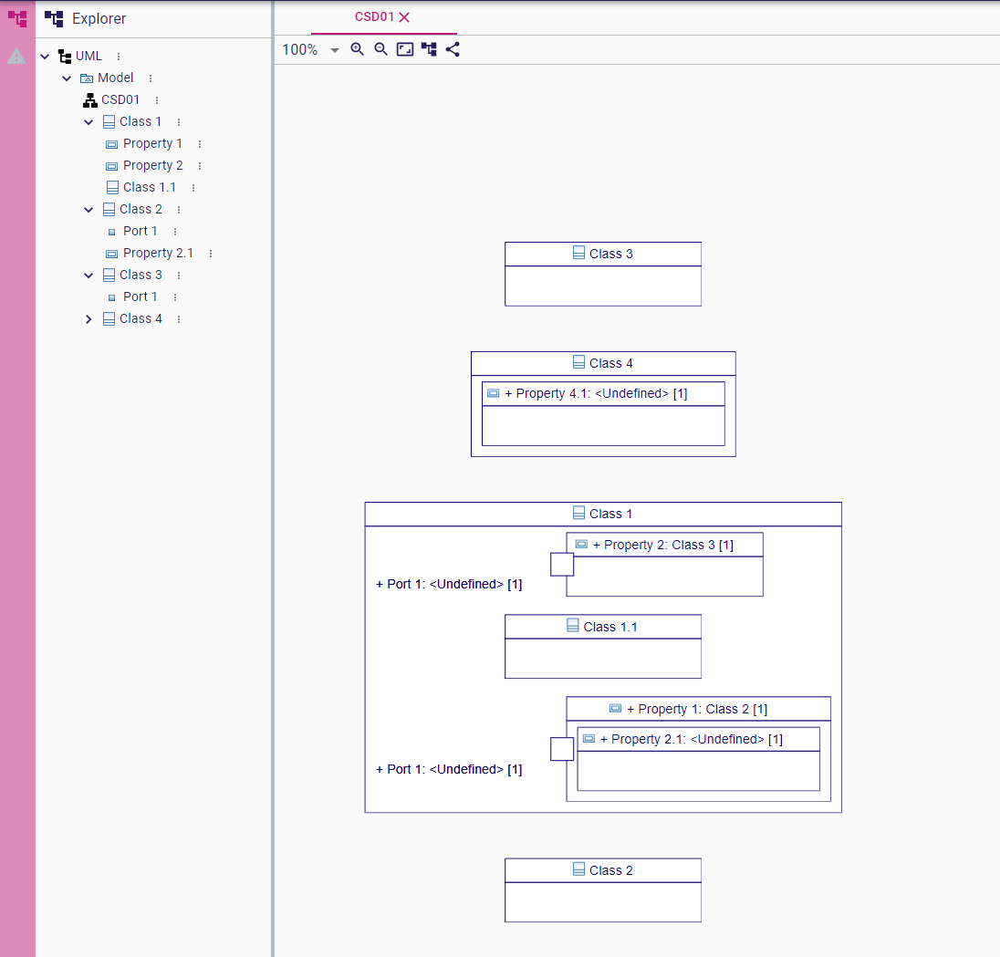
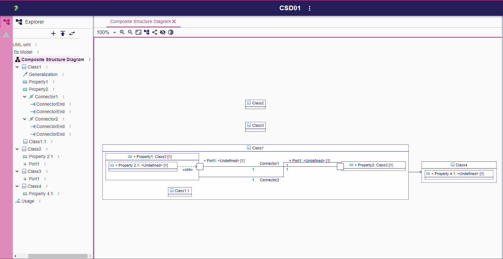

= Composite Structure Diagram tests
:toc:

[WARN]
====
Do all those tests sequentially
====

== CSD01 - Creations

.Purpose
Check all creation in the _Composite Structure Diagram_.

.Recipe
. Creation a new Project: _CSD01_
. Create a UML _Model_ (using _Create new Model_ helper)
. Create a _Composite Structure Diagram_ on _Model_ named _CSD01_
. Using the palette create a _Class_ on the diagram background
** [ ] A new Node with a label _Class 1_ should appear (with its new semantic element)
. Create a second _Class_ in the diagram background
** [ ] A new Node with a label _Class 2_ should appear (with its new semantic element)
. Inside _Class 1_ create a _new Class_
** [ ] A new Node inside _Class 1_ with a label _Class 1_ should appear (with its new semantic element)
. Using the property view, change the name of the nested class to _Class 1.1_
** [ ] The label of the matching node should be updated
. Inside _Class 1_ create a _new Property_
** [ ] A new Node inside _Class 1_ with a label _Property 1_ should appear (with its new semantic element)
. Create a new _Port_ on _Property 1_
** [ ] Nothing should be done (need to set a _type_ on _Property 1_ before)
. Using the property view, set the type of _Property 1_ to _Class 2_
. Create a new _Port_ on _Property 1_
** [ ] A new node _Port 1_ should appear on _Property 1_.
** [ ] The new _Port_ should be semantically created in _Class 2_
. Create _new Property_ on _Property 1_
** [ ] A new node _Property 1_ should appear on _Property 1_.
** [ ] The new _Property_ should be semantically created in _Class 2_
. Rename it _Property 2.1_
. Create:
** Two other classes at the root of the diagram _Class 3_ and _Class 4_
** Create a _new Property_ _Property 2_  in _Class 1_
** Create a _new Property_ _Property 4.1_  in _Class 4_
** Set the _type_ of _Property 2_ to _Class 3_
** Create a _new Port_ on _Property 2_

== CSD10 - Edge Creation

.Requirements
. Starts from CSD01

.Purpose
Check all edge creations in the diagram.

.Recipe
. Create a _new Connector_ between _Property 1::Port 1_ to _Property 2::Port 1_
** [ ] An edge should appear in both Ports_
** [ ] A connector should be created in _Class 1_
** [ ] The feature _role_ and _partWithRole_ on the _ConnectorEnd_ of the _Connector_ should be set correctly (first role=Port 1 partWithport=Property1 second role=Port1 partWithport=Porperty 2)
. Use auto layout
. Creates a _new Generalization_ between _Class 1_ and _Class 4_
** [ ] An edge should appear between the elements
** [ ] A new _Generalization_ should be created in _Class 1_
. Creates a _new Usage_ between _Property 1::Property 2.1_ and _Property 1::Port 1_
** [ ] A new edge should appear between the elements
** [ ] A new usage should be created under the _Model_ element
. Create a _new Connector_ between _Property 1_ to _Property 2_
** [ ] An edge should appear between both Properties_
** [ ] A connector should be created in _Class 1_
** [ ] The feature _role_ only (not _partWithRole_) on the _ConnectorEnd_ of the _Connector_ should be set correctly (first role=Property 1 second role=Property2)
. Use auto layout

== CSD20 - DnD

.Requirements
. Start from CSD10 (or its semantic model)

.Purpose
Check that a diagram can be created only using Drag and Drop tools

.Recipe
. Create a new _Composite Structure Diagram_ name _CSD20_
. DnD _Class 1_ on the diagram
** [ ] A node _Class 1_ should appear
. DnD _Class 1::Property 1_ on _Class 1_
** [ ] A new _Property 1_ should appear
. DnD _Class 1::Property 2_ on _Class 1_
** [ ] A new _Property 2_ should appear
** [ ] An edge _Connector 2_ should appear between the two _Properties_
. DnD _Class 2::Port 1_ on _Property 1_
** [ ] A bordered node should appear on _Property 1_
. DnD _Class 3::Port 1_ on _Property 2_
** [ ] A bordered node should appear on _Property 2_
** [ ] An edge between the ports should be displayed (_Connector 1_ )
. Dnd _Class 4::Property 4.1_ on _Class 1_ (inherited member)
** [ ] A new node _Property 4.1_ should DnD from _Class 4_
. Type  Property 4.1 with  _Class 4_ 
** [ ] The label of _Property 4.1_ should be _+ Property 4.1 : Class 4 [1]_
. Create a _new Port_ on _Property 4.1_ and connect it with a _Connector_ to _Class 1::Property 1::Port 1_
. DnD _Class 2_ on _Property 4.1_
** [ ] The type of _Property 4.1_ should be set to _Class 2_
** [ ] _Connector 3_ should be deleted (semantically)
** [ ] The bordered node and the edge from _Property 4.1_ should be deleted
. DnD _Class 4_ on the diagram
** [ ] The node _Class 4_ should be dsiplayed
** [ ] The _Generalization_ link between _Class 1_ and _Class 4_ should be displayed
. DnD _Class 2::Property 2.1_ in the node _Class 1::Property 1_ (bug https://github.com/PapyrusSirius/papyrus-web/issues/49)
** [ ] A new child node _Property 2.1_ should be added to _Class 1::Property 1_
** [ ] A _use_ edge should appear between  _Class 1::Property 1::Property 2.1_ and  _Class 1::Property 1::Port 1_

== CSD30 - Delete

[NOTE]
====
All deletions are done using the tool from the diagram. Never delete using the _Explorer_ view.
====

.Requirements
. Start from CSD20

.Purpose
Check that the deletion tools work properly

.Recipe
. Open diagram _CSD20_
. Semantically delete the _Generalization_ between _Class 1_ and _Class 4_ (when a selection is done there is a known bug hiding some other edges  https://github.com/PapyrusSirius/papyrus-web/issues/48)
** [ ] The node _Property 4.1_ should be deleted from the child of _Class 1_
. *Semantically* delete  _Class 1::Property 1::Property 2.1_ (from diagram)
** [ ] Both the node and the edge should be deleted from the diagram
** [ ] The _Property 2.1_ should be deleted from _Class 2_ (semantically)
** [ ] The _Usage_ link should be deleted from the _Model_ element (semantically)
. DnD _Class 2_ and _Class 3_ in the diagram
. *Semantically* Delete _Class 2_
** [ ] The node should be deleted
** [ ] The _type_ of _Class 1::Property 1_ should be set to null
. *Graphically* Delete  _Class 1::Property 2_
** [ ] The node _Property 2_ and the edge _Connector 2_ should be deleted
** [ ] _Class 1::Property 2_ still exists in the model
. *Semantically* delete _Class 1_
** [ ] Only _Class 3_ and _Class 4_ remain in the diagram and in the semantic model

