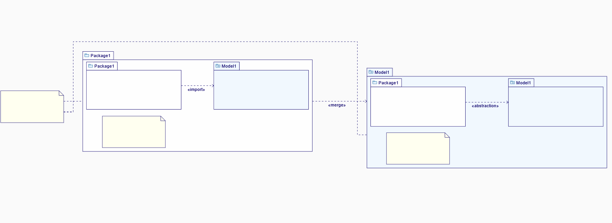

= Package Diagram tests

[WARN]
====
Do all those tests sequentially
====

== PD01 - Creations

.Purpose
Check all creations in the _Package Diagram_.

.Recipe
. Create a new Project from _UML template_
. From the _Explorer_ view use the contextual menu of _Model_ element to add a new representation.
. In the _Create a new representation dialog_, choose _Package Diagram_ as the representation type
** [ ] A new _Package Diagram_ is created and opened
. Using the palette create the following elements:
** New Package
** New Model
** New Comment

. Select the _Comment_ and use the palette to add the following links:
** a link between the _Comment_ and the _Package_
** a link between the _Comment_ and the _Model_

. Select the newly created _Package_ and use the palette to create the following elements:
** New Package
** New Model
** New Comment

. Select the root _Model_ element and add the following children:
** New Package
** New Model
** New Comment

. Select the root _Package_, use palette to create a _New Package Merge_ link to the root _Model_ element
. Select the nested _Package_ and create a _New Package Import_ to the sibling _Model_ element
. Select the inner _Package_ of the root _Model_ element, create a _New Abstraction_ link to its sibling _Model_ element
** [ ] The diagram should look like this

== PD10 - Diagram deletion

.Purpose
Check diagram elements deletion in the _Package Diagram_.

.Recipe
. Select _Model_ child of the root _Package_ and using the palette delete this element from the diagram only
. Redo the previous step with all elements present in the diagram
** [ ] No elements are present in the diagram
** [ ] Check that elements are still present in the tree of the _Explorer_ view

== PD20 - Drag and Drop

.Purpose
Check elements drag and drop in the _Package Diagram_.

.Recipe
. From the tree of the _Explorer_ view, select each element and drag it back into the diagram
** [ ] Check that the diagram is fully restored

. From the _Explorer_ view, select and drag the inner _Package_ of the root _Package_ to the diagram (outside any container)
** [ ] Check that the dropped _Package_ has a _containment_ link from the parent _Package_ (rounded cross head)

== PD30 - Global Deletion

.Purpose
Check elements global deletion in the _Package Diagram_.

.Recipe
. Select each child element of the root _Model_ and use the palette to delete them one by one.
. Delete as well the root _Model_ which is now empty.
. Select the _Comment_ element contained inside the root _Package_ element, use the _Delete_ action from the contextual menu to remove this _Comment_ element
** [ ] Check that removed elements are no longer present in both diagram and _Explorer_ views

== PD40 - Link Reconnect

.Purpose
Check link reconnection in the _Package Diagram_.

.Recipe
. Select the root _Package_ and add a new _Model_ element as a child (now there are two _Model_ elements inside the _Package_)
. Select the _import_ link and reconnect it from the first _Model_ to the second one
** [ ] Check that inner _Package_ is now connected to the second _Model_ element

. Select the _import_ link, grab the handle from the _Package_ and reconnect it to the first _Model_ element
** [ ] Check that _Model_ elements are now connected with the merge link

== PD50 - Direct edit

.Purpose
Check direct edit in the _Package Diagram_.

.Recipe
. Select the root _Package_ and form the palette using the direct edit tool, change the name of the _Package_
. Rename once again the name of the root _Package_ using the property view (_Details_ view)
. From the tree of the _Explorer_ view, use the _edit_ action of the contextual menu to change the name of an element
** [ ] For each rename action made above, check that the name is properly changed in all following places:
*** Tree of the _Explorer_ view
*** Diagram element
*** _Details view_
