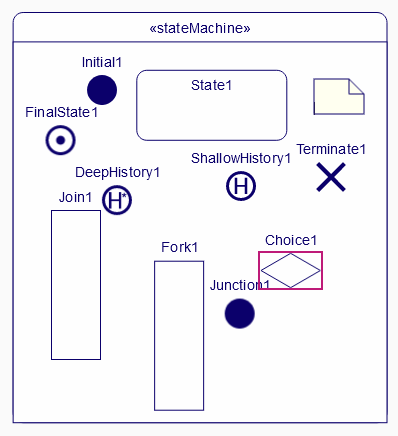
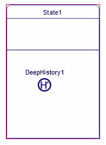
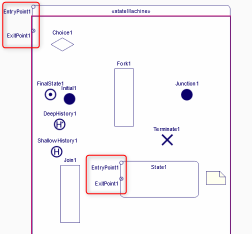

= State Machine Diagram tests
:toc:

[WARN]
====
Do all those tests sequentially
====

== SMD10 - State Machine objects creation

.Purpose
Check all creation in the _State Machine Diagram_.

.Recipe
. Creation a new Project: _SMD01_ (using _UML Empty_)
. Create a UML _Model_ (using _Model UML_ stereotype)
. Create a _StateMachine_ in _Model_
. Create a _State Machine Diagram_ on _StateMachine_
** [ ] A stateMachine node is displayed in the diagram
. Select the stateMachine node and create a _Region_ with the palette
** [ ] A new Region is  a displayed in the stateMachine node
. Select the region and create all kind of elements with the palette
** [ ] Each elements is displayed in the region
+

+
. Select the _state1_ node and create two times a Region with the palette
. Select the second region node and create any object with the palette
** [ ] the regions in the state are displayed vertically
+

+
. Select the _stateMachine_ node and create EntryPoint and ExitPointwith the palette
. Select the _state1_ node and create EntryPoint and ExitPoint with the palette
** [ ] EntryPoint and ExitPoint are displayed as border nodes on _state1_ and _stateMachine_ (note that EntryPoint and ExitPoint override themselves but it is not a bug)

== SMD20 - Edge Creation and reconnection

.Requirements
. Starts from SMD01

.Purpose
Checks all edge creations in the diagram.

.Recipe
. Select _Initial1_ and select _New Transition_ in the palette and the select _State1_  
** [ ] And edge is displayed oriented from _Initial1_ to _State1_
. Idem : create a Transition between _State1_ and _FinalState1_.
** [ ] And edge is displayed oriented from _State1_ to _FinalState1_
. Reconnect source of a transition to _Join1_
** [ ] Reconnection succeeds and edge display is updated
. Reconnect target of a transition to _Fork1_
** [ ] Reconnection succeeds and edge display is updated

== SMD30 - Drag and Drop (inside Diagram)

.Purpose
Check all the drag and drop in the _State Machine Diagram_.

.Recipe
Create a new State State_DND in the first region and create a Region in this State.
Drag and Drop all the element of the State Machine into the State_DND (into its region). 
Drag and Drop all the element from State_DND back into the StateMachine.
Delete State_DND from the model.

== SMD40 - Drag and Drop (from Model Explorer)

.Requirements
. Start from SMD30 (same state as SMD20) (or its semantic model)

.Purpose
Check that a elements can be created on the diagram only using Drag and Drop tools

.Recipe
. Create a new _State Machine Diagram_
. DnD _EntryPoint1_ of the StateMachine on the _StateMachine_ node
** [ ] The border node  is displayed
. DnD all elements contained in _StateMachine_ region into the _StateMachine_ region node
** [ ] All nodes are displayed
** [ ] Both edges are displayed

== SMD50 - Delete

[NOTE]
====
All deletions are done using the tool "Delete from model" from the contextual palette. Never deletes using the _Explorer_ view.
====

.Requirements
. Start from SMD03

.Purpose
Check that the deletion tools work properly

.Recipe
. Select _Transition_ edges and delete it
** [ ] The Transitions are not displayed in the Explorer tree and not in the diagram
. Idem selecting all nodes
** [ ] The corresponding elements neither displayed in the Explorer tree nor in the diagram
** Select the StateMachine region and delete it from Explorer tree.
** [ ] The Region is neither displayed in the Explorer tree nor in the diagram
