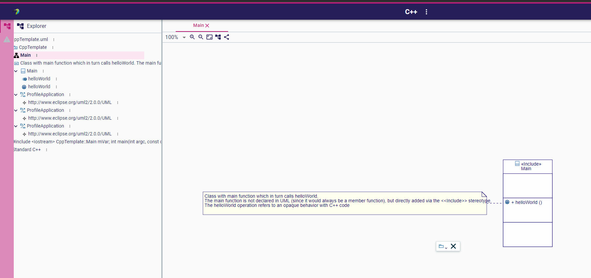
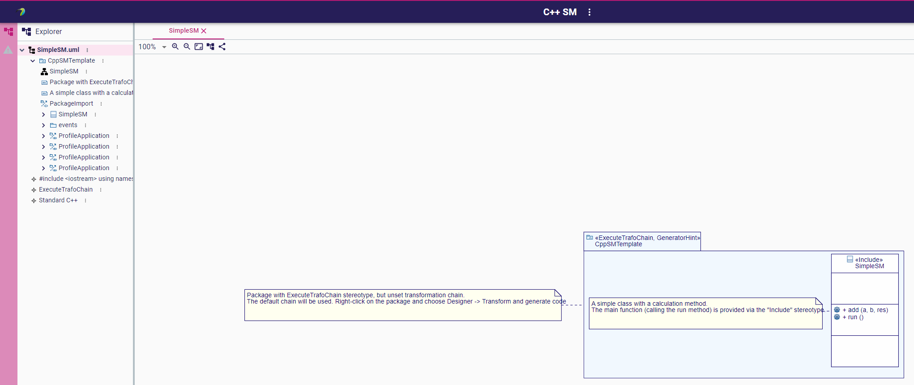
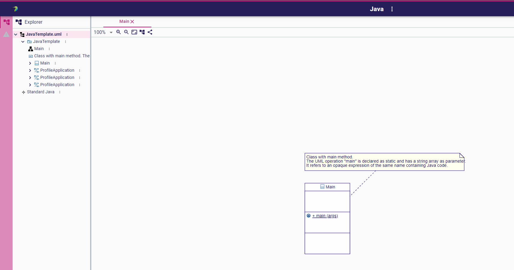

= Project Templates
:toc:

== PT01 - Available templates

.Purpose
Check that all templates are available from the home page

.Recipe
. Home Papyrus Web home page
** [ ] Check that following project cards are available:
*** _+ {cpp}_
*** _+ {cpp} SM_
*** _+ Java_
. Click on _Show all templates_
** [ ] All previous cards should be available
** [ ] The _UML_ default template should be available

== PT10 - _{cpp}_ template

.Purpose
Check the content of the _{cpp}_ template

.Recipe
. Using the _+ {cpp}_ card create a new _{cpp}_ project
** [ ] Check that the content of the model is similar to link:resources/CppTemplate.uml[]
. Open the _Main_ Class Diagram
** [ ] Check that the diagram display the same elements as:

== PT20 - _{cpp} SM_ template

.Purpose
Check the content of the _{cpp} SM_ template

.Recipe
. Using the _+ {cpp} SM_ card create a new _{cpp} SM_ project
** [ ] Check that the content of the model is similar to link:resources/SimpleSM.uml[]
. Open the _Simple SM_ Class Diagram
** [ ] Check that the diagram display the same elements as:

== PT30 - _Java_ template

.Purpose
Check the content of the _Java_ template

.Recipe
. Using the _+ Java_ card create a new _Java_ project
** [ ] Check that the content of the model is similar to link:resources/JavaTemplate.uml[]
. Open the _Main_ Class Diagram
** [ ] Check that the diagram display the same elements as:

